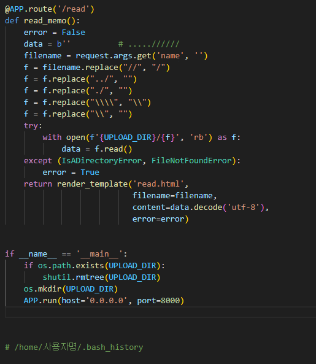
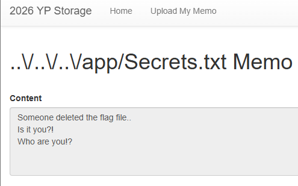
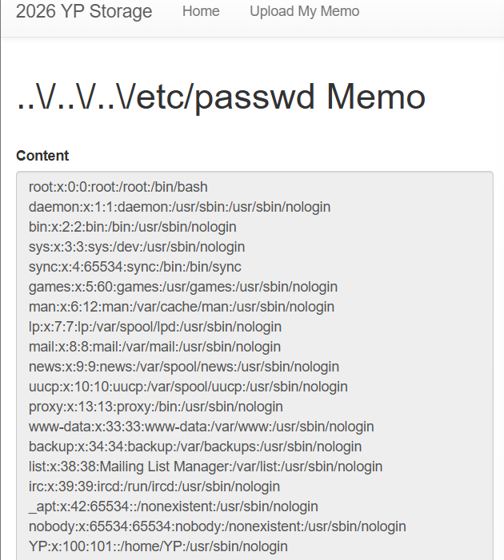
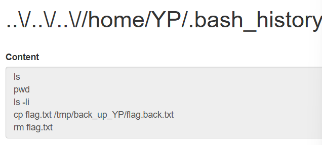
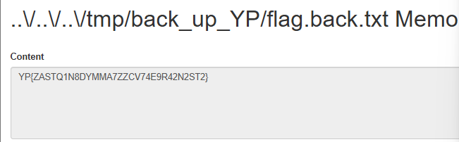

이전에 풀었던 걸 다시 푸니까 잘 풀려서 뭔가 감회가 새롭네요

볼만한 부분은 역시 app.py 그리고 Dockerfile인듯 Dockerfile을 보면

WORKDIR /app 으로 기본 작업폴더가 /app이라는 걸 나타내고, COPY Secrets.txt . 로 Secrets.txt를 /app에 복사했다는 걸 알 수 있음

이 문제도 다른 거랑 비슷하게 경로 탐색 문제고 upload_memo()를 보면 파일을 올릴 때 파일명에 ..이 들어가지 않게 if문으로 처리한 걸 볼 수 있음

근데 read_memo()에서는 입력값에 ..가 안 되게 처리하는 부분이 없음. 정확히는 있긴한데 좀 허술함

여기서 //와 .을 처리하기는 하는데 한 번만 동작해서

.....//////을 하면 저 부분을 통과했을 때 ../만 남게되어 우회, 그냥 \.\.\/, ..\/..\/..\/ 처럼 해도 우회됨

일케 우회되고 나면 이제 파일 위치만 찾으면 됨

read_memo() 에서 open을 하니까 사실상 cat 명령어를 대신한다고 볼 수 있음

이제 그러면 우회하는 로직을 통해서 cat 명령어(open 함수)을 쓸 수 있게 됐으니까 처음에 /app/Secrets.txt를 먼저 보면

ㅇㅈㄹ 해놨음. 여기에 플래그 파일이 있었는데 누군가가 삭제해버린 거임~ 이라고 하네요

그리고 문제에서 계속 역사 역사 ㅇㅈㄹ 하니까 history 파일이 중요하다는 걸 알 수 있음 (사실 다른 애들이 알려줬었음)

리눅스에서 히스토리 파일 기본 위치는 /home/사용자명/.bash_history 라고함

이제 사용자명을 알면 되는데 그러기 위해서 유저에 관한 정보가 있는 /etc/passwd를 보면 됨

제일 아래를 보면 유저는 YP라고 나와있네요. 근데 사실 docker-compose.yml을 보면 user: "YP"가 되어있긴함.. 암튼

사용자명도 알았으니까 /home/YP/.bash_history 로 이동하면

이렇게 플래그 파일이 원래 있었는데 rm flag.txt를 통해서 삭제했다는 것도 보이고, /tmp/back_up_YP/flag.back.txt로 복사했다는 것도 알 수 있음

이제 해당 위치로 가서 읽으면

답이 나오는 것이와용~

그래도 역시 완전 처음 풀었을 때 보다는 성장한 거 같아서 다행인듯함..

