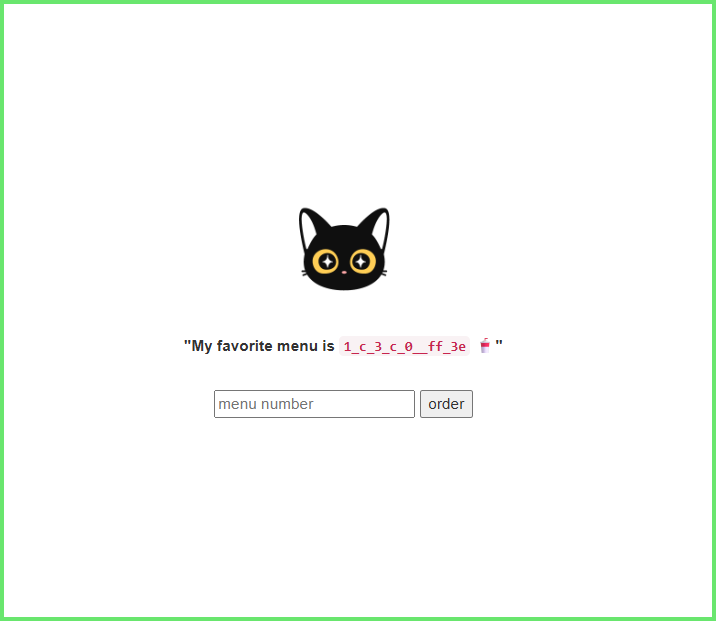

문제 사이트는 1_c_3_c_0__ff_3e 말고는 볼 거 없으니까 넘어가고 app.py를 보면 됨
1_c_3_c_0__ff_3e는 중간에 연산과정을 통해서 FLAG -> org -> menu_str 이 됨 FLAG값을 얻으려면 org값만 알아내면 됨
따라서 menu_str(1_c_3_c_0__ff_3e)을 org로 역연산만 하면 됨

우선 이해를 위해서 예시 플래그를 사용해서 코드를 따라가봄

플래그 형태는 flag.txt에 예시가 적혀있음

FLAG = DH{55f2394156567886667940273839575eb0af4b3f115345f0cc8b9}

여기서 FLAG[10:29]를 통해서 org를 만듦

org = 1565678866679402738

    for i in range (0, 16):
        res = (org >> (4 * i)) & 0xf
        if 0 < res < 12:
            if ~res & 0xf == 0x4:
                st[16-i-1] = '_'
            else:
                st[16-i-1] = str(res)
        else:
            st[16-i-1] = format(res, 'x')
    menu_str = menu_str.join(st)

위 코드를 해석하자면

res = (org >> (4 * i)) & 0xf -> 비트 연산자(>>)를 통해서 4자리씩 오른쪽으로 옮김, 옮긴 다음 & 0xf를 통해서 맨 오른쪽의 4자리만 남김

org 끝의 4자리를 가지고 하면 2738 -> 0010 0111 0011 1000 이렇게 됨

여기서 i가 0이면 org >> 0 으로 비트가 안 옮겨지고 0010 0111 0011 1000 끝의 4자리만 남겨서 1000(=8)만 res로 들어감

i가 1이면 org >> 4로 비트가 4개가 오른쪽으로 이동해서 0010 0111 0011 (1000, 자리 이동으로 삭제됨) 끝의 4자리만 남겨서 0011(=3)만 res로 들어감

이 과정으로 각 자리의 res를 구함
        if 0 < res < 12:
            if ~res & 0xf == 0x4:
                st[16-i-1] = '_'
            else:
                st[16-i-1] = str(res)
        else:
            st[16-i-1] = format(res, 'x')
여기는 크게 중요한 건 없고 표시만 바뀜, if ~res & 0xf == 0x4: 는 if res == 11: 이라는 뜻으로 res가 11이면 st에 _을 넣고 그게 아니면 문자로 넣음
res가 12이상 15이하면 hex 알파벳으로 st에 넣음

이 과정을 표시

FLAG = DH{55f2394156567886667940273839575eb0af4b3f115345f0cc8b9}

org = 1565678866679402738

(이때 바뀔 때 각 자리를 2진수로 바꾸는 게 아니라 org값 전체를 하나의 값으로 해서 2진수로 변환함, 계산기 사용)

org = 0001 0101 1011 1010 0110 1000 1010 0010 0100 1000 1100 0011 0001 0000 1111 0010

org = 1 5 11 10 6 8 10 2 4 8 12 3 1 0 15 2 

menu_str = 1 5 _ 10 6 8 10 2 4 8 c 3 1 0 f 2 

이제 위 과정을 반대로 하면 됨

1_c_3_c_0__ff_3e (1칸씩 띄우기)

1 _ c _ 3 _ c _ 0 _ _ f f _ 3 e (_를 11로 변환)

1 11 c 11 3 11 c 11 0 11 11 f f 11 3 e (hex 알파벳을 숫자로 변환)

1 11 12 11 3 11 12 11 0 11 11 15 15 11 3 14 (각 숫자를 2진수로 변환)

0001 1011 1100 1011 0011 1011 1100 1011 0000 1011 1011 1111 1111 1011 0011 1110 (변환된 2진수들을 붙여서 하나의 숫자로 취급해 10진수로 변환, 계산기 사용)

2002760202557848382 (org!)

DH{e4f547e200276020255784838237d30bfed6b1c6065dbbd7102853bf3dd}

