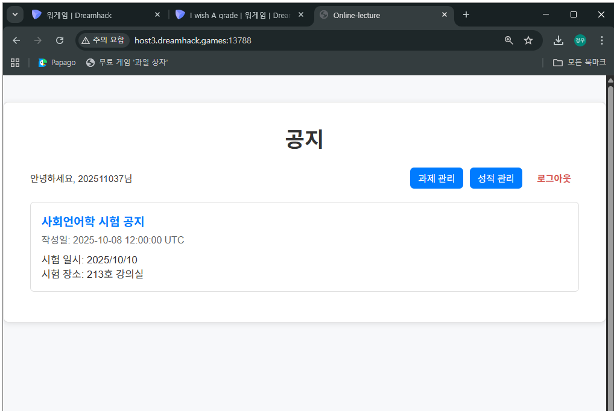
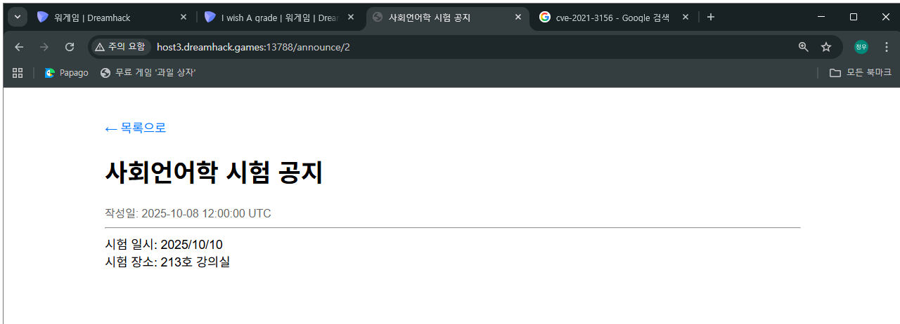
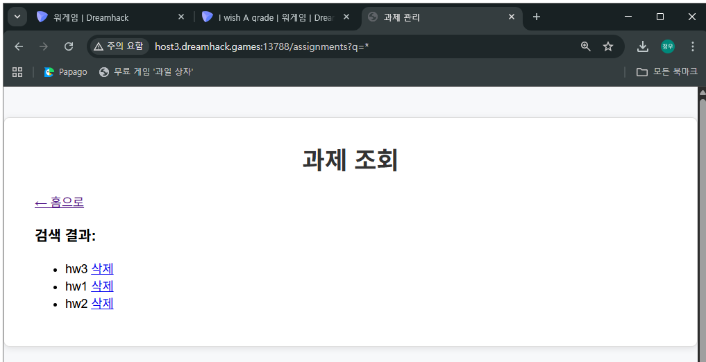
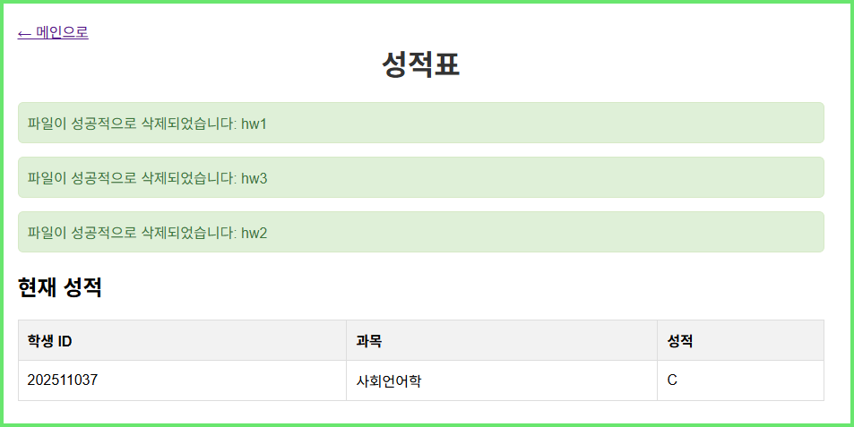
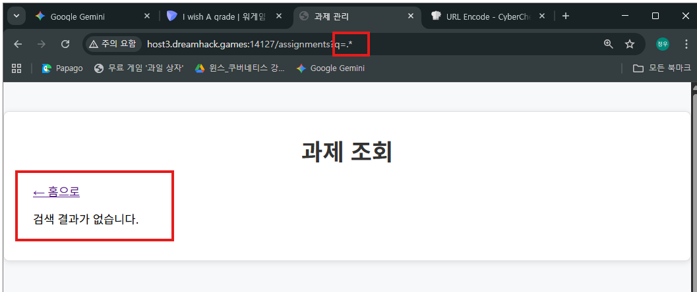

메인

공지
announce/0
-> ..으로 시작하는 것은 막지만 중간에 ..이 들어가는 건 문제 없는듯함

announce/1

announce/2

과제(assignment)

성적(grades)

http://host3.dreamhack.games:14127/assignments?q=.

그냥 .을 입력하니까 되는데 왜 .*을 하면 안 되지

select * from db where username=user_id and password=user_pw; 

select * from db where userane=pro** and password=`some; select `

쉬이이이입펄 됐다... 나 혼자서는 거의 절대 못 풀었을듯

announce/0, announce/1을 통해서 현재 보안이 system/key.txt를 통해서 적용되어 있다는 걸 알 수 있고 key.txt를 삭제하면 무력화된다는 힌트를 줌

여기서 이제 어떻게하면 key.txt를 지울 수 있을지 생각해볼 수 있는데

과제 조회화면에서 ..와 /로 시작할 수 없다고 함

과제조회 url은 /assignments?q=* 이런 형태인데 여기서 q뒤의 값을 사용자가 지정할 수 있는데 여기에 시작할 때 ..와 /를 쓸 수 없다고함

근데 시작할 때만 못 쓰는 거니까 ./../../ 와 같이 쓰면 사용할 수 있는 거임!!!

그래서 ./../../etc/* 와 같이 해서 경로에 있는 것들을 볼 수 있었음 단, 경로에 파일 내용은 못 보고 경로안에 어떤 파일들이 있는지만 확인할 수 있었음

그렇게 보다가 ./../../system/*로 key.txt를 확인할 수 있었음

확인한 건 좋았는데 여기서 삭제 버튼을 눌러도 삭제가 안 됐음

그래서 이것도 준석이가 알려줬는데 지금은 아직 ..으로 시작하는 걸 제한하는 필터가 걸려있는데 검사도구의 네트워크를 통해서 삭제를 했을 때의 전송된 데이터(페이로드)를 보면 

../../system/key.txt 가 전송됨

아마도 삭제 버튼을 누르면 삭제 메서드에 삭제 버튼이 눌린 파일의 위치가 페이로드로 포함되어 전송돼서 해당 파일 위치의 파일을 삭제하는 거 같음

근데 system/key.txt가 ..으로 시작하는 경로를 가지고 있어서 삭제가 안 되던 것

그래서 검사도구의 elements를 보면 삭제 버튼에 `confirmDelete(&quot;../../system/key.txt&quot;)` 와 같은 경로를 보내는 부분이 있어서 여기서 경로의 앞에 ./을 붙여서 ..으로 시작하지 않도록 바꾸면 삭제가됨

삭제하고 나면 이제 방화벽이 무효화됨. 중요한 건 그래서 교수의 계정으로 어떻게 로그인해서 성적을 수정할 수 있느냐인데

이것도 준석이가 가르쳐줌 대 준 석

서버에서 로그인 기능이 있으면 당연히 계정들을 받아야하니까 보통 데이터베이스를 씀

sql db를 쓴다면 입력을 받을 때 `SELECT * FROM users WHERE id='' AND pw='...'`와 같은 형식을 자주 씀. 그런데 기존에는 아이디나 비밀번호 입력을 할 때 방화벽 정책에 의해서 필터링이 되고 있었겠지만 이제는 그런 것이 없으니 sql injection을 통해서 로그인을 하면 됨

select * from users where username='(id 입력)' and passwd='(비밀번호 입력)'

이런 형태라면 그냥 id에 `' or 1=1 --`라고 입력하고 비밀번호는 아무거나 해도 됨.

근데 아뿔싸.. `' or 1=1 --`를 id로 입력하면 where이 그냥 TRUE가 되어버리기 때문에 테이블 전체가 출력됨

근데 최소 2개의 계정인 학생과 교수의 계정 중에서 학생의 계정이 위에 위치해서 그런가 학생의 계정으로 로그인됨

여기서 2가지 해결 방법이 있는데 참고로 하나는 원석이형 방법이고, 하나는 준석이가 또 알려줌! 데헷!

1. 교수의 id가 pro로 시작하니까 pro$를 통해서 교수의 데이터만을 뽑아낼 수 있음 (준석이)
근데 또 아뿔싸.. pro$를 쓰려면 `like`를 쓸 수 있어야하는데 `like`는 username= 에서 이미 =를 쓰는 것 같아서 쓸 수 없음!
오또카지 하다가 

그냥 username은 찍어서 하면 어떻게 된다해서
`' or username like 'pro%' --` -> `SELECT * FROM users WHERE username='' AND pw='...'`
이렇게 작성하면 교수의 데이터만 특정해서 가져올 수 있게됨!

2. 이건 원석이형이 한 방법인데 단순하게 현재 테이블에서 데이터는 2개가 있고 학생의 데이터가 위에 올라와있는 거 같으니까 그냥 순서를 위아래 뒤집기로함

그래서 기존에 쓸 수 없던 `' or 1=1 --`에 id를 써서 내림차순으로 정렬시킨 `' or 1=1 order by id DESC;--`를 쓰면 교수가 위로 올라오면서 로그인할 수 있게됨!

이번 건 처음으로 블랙 박스로 풀어서 그런가 꽤나 신선하기도 했고, 코드에 의존이라고 해야하나 안 하다보니까 더 갈피도 못 잡아서 어려운 느낌도 있었지만 그래도 머리속으로 그림이 그려지는 느낌이라서 좋았던 거 같기도함

내가 푼 부분은 10% 이하정도 밖에 안 되는 거 같기는한데..

그리고 이건 풀면서 도움이 됐던 [온라인 sql 사이트](https://www.mycompiler.io/ko/online-sql-editor)

