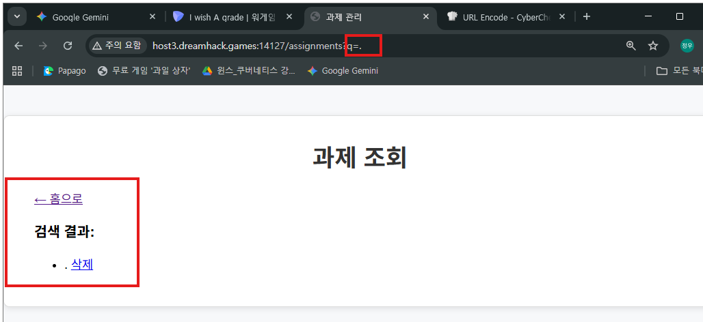

메인

공지
announce/0
-> ..으로 시작하는 것은 막지만 중간에 ..이 들어가는 건 문제 없는듯함

announce/1

announce/2

과제(assignment)

성적(grades)

http://host3.dreamhack.games:14127/assignments?q=.

그냥 .을 입력하니까 되는데 왜 .*을 하면 안 되지

select * from db where username=user_id and password=user_pw; 

select * from db where userane=pro** and password=`some; select `

쉬이이이입펄 됐다... 나 혼자서는 거의 절대 못 풀었을듯

announce/0, announce/1을 통해서 현재 보안이 system/key.txt를 통해서 적용되어 있다는 걸 알 수 있고 key.txt를 삭제하면 무력화된다는 힌트를 줌

여기서 이제 어떻게하면 key.txt를 지울 수 있을지 생각해볼 수 있는데

과제 조회화면에서 ..와 /로 시작할 수 없다고 함

과제조회 url은 /assignments?q=* 이런 형태인데 여기서 q뒤의 값을 사용자가 지정할 수 있는데 여기에 시작할 때 ..와 /를 쓸 수 없다고함

근데 시작할 때만 못 쓰는 거니까 ./../../ 와 같이 쓰면 사용할 수 있는 거임!!!

그래서 

SELECT * FROM users WHERE id='' AND pw='...'

' or 1=1 order by id DESC;--

